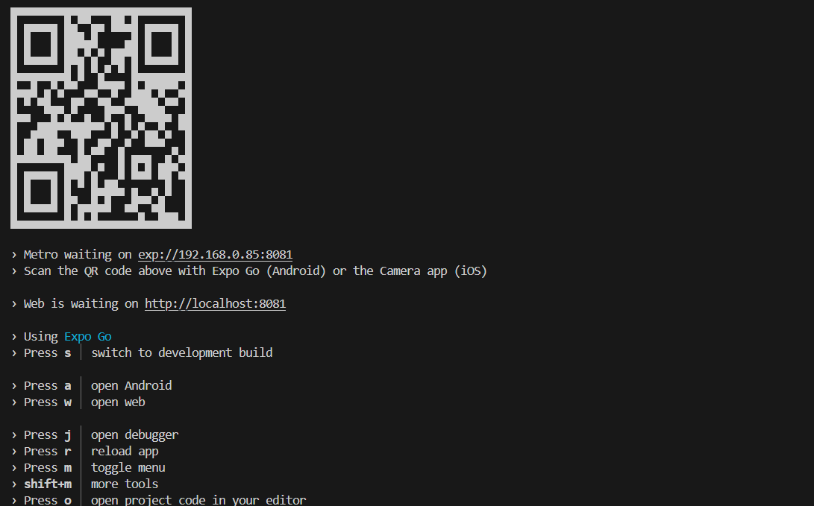

# 📄 React Native App Fejlesztői dokumentáció.

## ⚙️ Technológiák

* JavaScript
* React
* Tailwind
* Websocket

## ⬆️ Telepítés - Függőségek

1. *cd /weboldal*
2. *npm install*
3. *Expo Go alkalmazás letöltése telefonra*

   

## 🟢 Elindítás

1. npx expo start
2. Megjelenik egy QR kód és be kell szkennelni a telefonnal (Fontos hogy ugyanazon neten legyen a telefon és ahol az alkalmazás fut)

   
